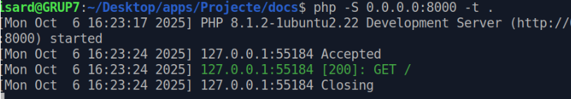

# Inicio
# **AP - Trabajo con git y despliegue de código inicial - Grupo 7** 

***Objetivo***

En esta actividad será necesario trabajar con la herramienta github. A partir de un código web, conmitarlo en un repositorio, desplegarlo sobre los sistemas y aplicar cambios en el código para solucionar un “bug” que tiene el código.

## Miembros del equipo 

- Bryan Aguilera
- Miquel Serra
- Giuseppe Suarez
- Kristian Toledo

## Índice

- [Herramientas y/o servicios](#herramientas-y--o-servicios-que-hemos-utilizados)
- [Procedimiento de Instalación y configuración del servidor](#procedimiento-de-instalación-y-configuración-del-servidor)
  - [Apache2](#apache2)
  - [Git](#git)
  - [Base de Datos - MySQL](#base-de-datos---mysql)
  - [PHP](#php)
- [Comprobación final](#comprobación)

## Herramientas y / o servicios que hemos utilizados

- Apache2
- PHP
- MySQL
- GitHub

# Procedimiento de Instalación y configuración del servidor

## Apache2

*En nuestro servidor deberemos instalar el Apacahe2, por ende usaremos el siguiente comando*

*Revisaremos el estado del servicio que acabamos de instalar como es la de Apache2*

## Git

*Instalaremos el Git para que podamos hacer el commit de los archivos*

*Estos archivos lo subiremos al git, haremos el commit*

*Vincularemos el Git y comprobaremos que es correcto y esta disponible*

*Ahora hcimos el commit*

*Resubimos todo al repositorio porque nos dio un pequeño error de que no estaban sincronizados el Git con el del servidor*

## Base de Datos - MySQL

*A continuación mostraremos la tabla de nuestra base de datos que hemos creado. Usamos MySQL*

*Este es el contenido y el formato de nuestra base de datos*

## PHP 

*Ahora pondremos en marcha nuestro servicio de PHP*

## Comprobación

*Podemos abrir nuestro navegador e ingresar a la siguiente pagina; 
Donde nos deja ingresar usuarios, editar los que ya existen o incluso eliminarlos* 

*Si visulizamos la Base de Datos que teniamos antes, podriamos ver que los usuarios que ingresar y se registran en nuestra pagina se añadiran automaticamente a la tabla de nuestra base de datos*

[***Vuelve al inicio***](#inicio)
